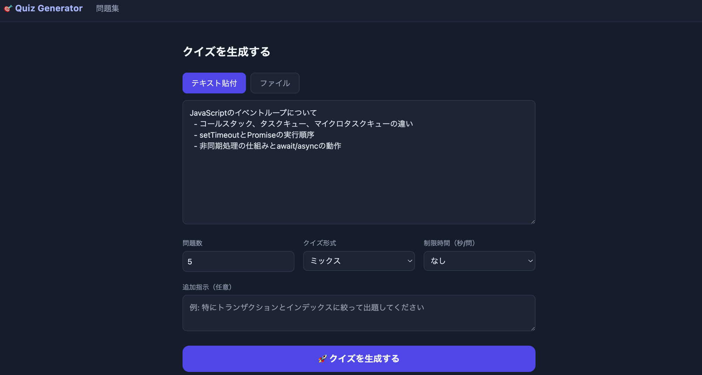

# quiz-generator

テキスト・ファイル・PowerPointスライドからAIが自動でクイズを生成するWebアプリ。



## 機能

- テキスト貼り付け / ファイルアップロード（.txt, .md, .pptx）からクイズを生成
- 4択問題・穴埋め選択問題・ミックス形式に対応
- 生成したクイズをブラウザ上でプレイ
- クイズライブラリで過去問を管理・エクスポート
- 制限時間付きモード

## セットアップ

### 必要なもの

- Go 1.23+
- [OpenAI APIキー](https://platform.openai.com/)

### ローカル起動

```bash
git clone https://github.com/takeshun256/quiz-generator.git
cd quiz-generator

cp .env.example .env
# .env を編集して OPENAI_API_KEY を設定

source .env
go run .
```

ブラウザで http://localhost:8080 を開く。

### Docker で起動

```bash
cp .env.example .env
# .env を編集して OPENAI_API_KEY を設定

docker compose up --build
```

## 環境変数

| 変数名 | 必須 | 説明 |
|--------|------|------|
| `OPENAI_API_KEY` | ✅ | OpenAI APIキー |
| `PORT` | - | サーバーポート（デフォルト: `8080`） |
| `DB_PATH` | - | SQLiteファイルパス（デフォルト: `./quiz.db`） |

## 技術スタック

- **Backend**: Go + [chi](https://github.com/go-chi/chi)
- **AI**: [OpenAI API](https://platform.openai.com/docs) (gpt-4o-mini)
- **DB**: SQLite ([modernc.org/sqlite](https://gitlab.com/cznic/sqlite))
- **Frontend**: HTML テンプレート + [htmx](https://htmx.org/) + [Tailwind CSS](https://tailwindcss.com/)

## ライセンス

MIT
